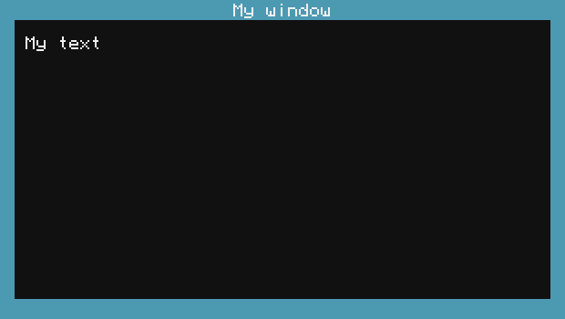
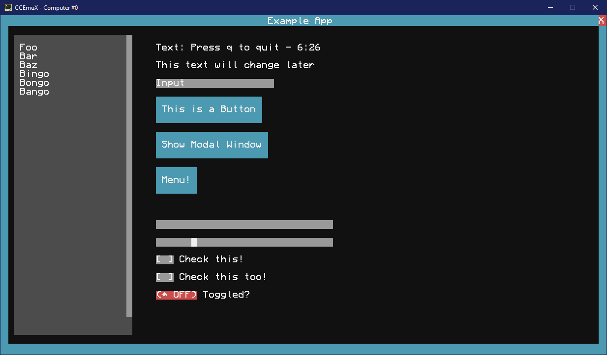

## Imevul UI - A simple Lua GUI library for ComputerCraft/CC:Tweaked built on top of Cobalt 2

Please see the `examples` folder for some examples on how to use. You can also [visit the Wiki](https://github.com/imevul/imevul-ui/wiki) to read the documentation.

[Cobalt 2](https://github.com/ebernerd/cobalt-2) is not included, and needs to be downloaded separately!

# Installation

Simply run `pastebin run beC3s7jZ` to download and install Imevul UI.

If you prefer, you can manually download the entire repository and put it in the root directory as-is. You should then have a folder structure that looks like `/imevul/ui`.
Alternatively, you can choose your own location, but you will need to update the config if you decide to do so.

# Updating
Run the installer again to update to the newest version. If you use the default folder structure,
it will automatically be removed and reinstalled.

# How to use

The different modules are made available with a `UI_` prefix, for example `UI_App`.

```Lua
local _ = dofile('/imevul/ui/init.lua')

-- Create the application itself
local app = UI_App({
	callbacks = {
		keyReleased = function(app, key, _)
			-- Make sure we can quit the application
			if key == 'q' then
				app:quit()
			end
		end
	}
})

-- Create a window
local win = UI_Window({
	title = 'My window',
	width = app.width,
	height = app.height
})

-- Add the window as a child to the app
app:add(win)

-- Create and add a text object as a child to the window
win:add(UI_Text({
	text = 'My text'
}), 2, 2)

-- Start the main event loop
app:initialize()
```

This above code will generate something that will look like this:



The advanced example from the `examples` folder looks like this:


